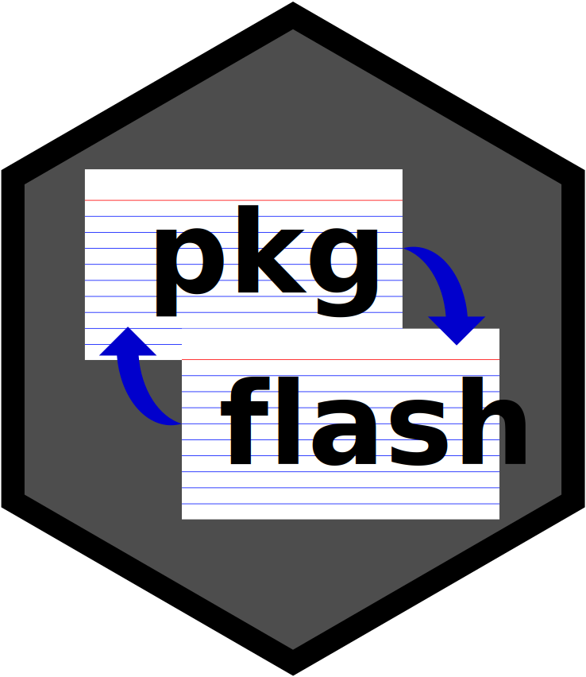

<!-- README.md is generated from README.Rmd. Please edit that file -->

```{r, include = FALSE}
knitr::opts_chunk$set(
  collapse = TRUE,
  comment = "#>",
  fig.path = "man/figures/README-",
  out.width = "100%"
)
```

# pkgflash <a href="https://r4ds.github.io/pkgflash/"></a>

<!-- badges: start -->
[](https://lifecycle.r-lib.org/articles/stages.html#experimental)
[](https://CRAN.R-project.org/package=pkgflash)
[](https://app.codecov.io/gh/r4ds/pkgflash?branch=main)
[](https://github.com/r4ds/pkgflash/actions/workflows/R-CMD-check.yaml)
<!-- badges: end -->

While modern IDEs make it easy to look up arguments to functions, if you actually know function syntax, you can read and understand code more quickly (see [*The Programmer's Brain* by Felienne Hermans](https://livebook.manning.com/book/the-programmers-brain/chapter-3/) for more information). 
{pkgflash} generates flashcards to make it easier to learn the syntax of a package's exported functions.

## Installation

You can install the development version of pkgflash from [GitHub](https://github.com/) with:

``` r
# install.packages("devtools")
devtools::install_github("r4ds/pkgflash")
```

## Example

I need to look into existing options for flashcards before I continue.
That might result in a change to what this first function returns, but the general idea is ready.

Let's say I'm trying to really wrap my head around the {rlang} package.
One thing that can help me read {rlang}-using code is to learn the functions and their arguments.

```{r function_data}
library(pkgflash)
rlang_fns <- pkg_fn_info("rlang")
```

I can see that there are `r length(rlang_fns)` functions exported from {rlang} (at the time that this README was built).

I use the `rlang::ns_env()` function in this package.
Let's look at its argument(s) (and their default values, if any) to begin to internalize how this function works.

```{r ns_env}
rlang_fns$ns_env
```

The sole argument to `rlang::ns_env()` is `x`, and its default value is `caller_env()`.
That's another function in {rlang}.

```{r caller_env}
rlang_fns$caller_env
```

`rlang::caller_env()` takes an argument `n`, which tells it how many callers to go back (ie, how far up the stack to go).

I envision the flashcards eventually showing a function name, and asking you to recall (and eventually maybe type in) the names of its arguments.
Or perhaps we'll allow you to "flip" the card again, by recalling the default values of those arguments.

Long-term, I would like to build in concepts such as spaced repetition and interleaving, to allow you to use this package as a learning tool.


## Code of Conduct

Please note that the pkgflash project is released with a [Contributor Code of Conduct](https://contributor-covenant.org/version/2/1/CODE_OF_CONDUCT.html). By contributing to this project, you agree to abide by its terms.
